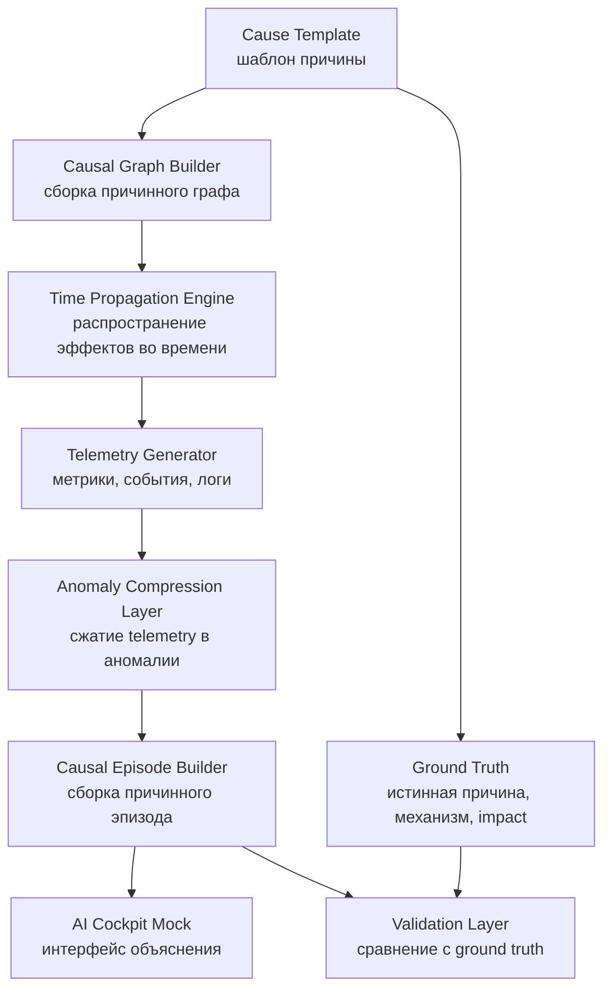
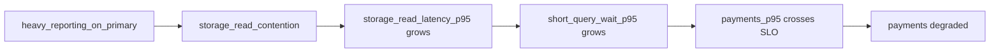
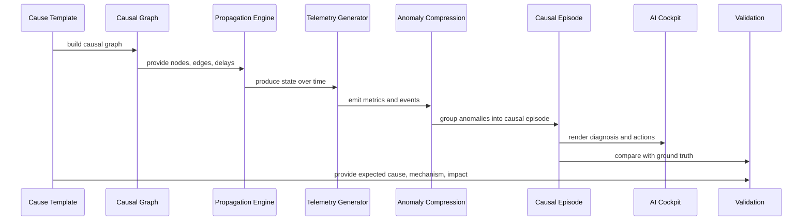
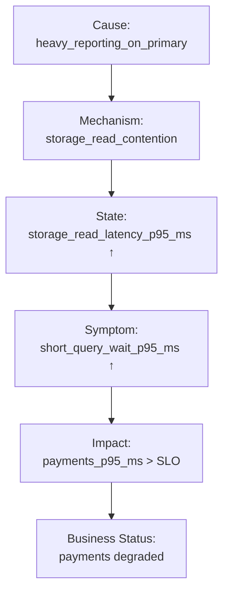
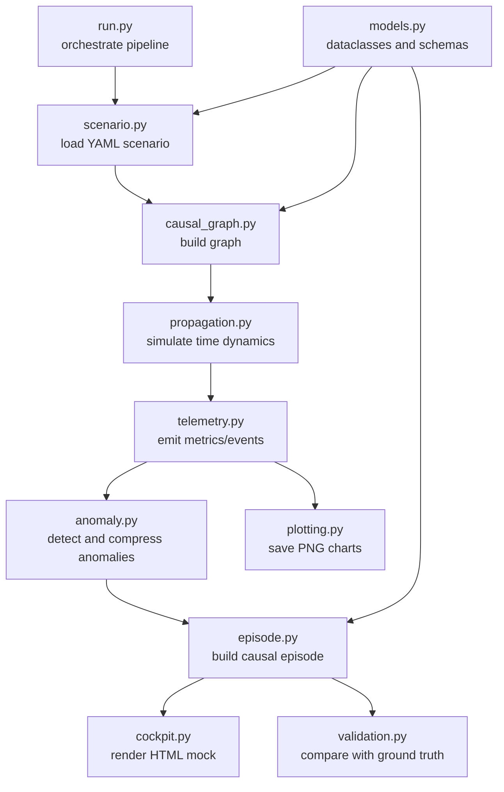

# Causal Load Simulator & AI Cockpit: верхнеуровневая спецификация (для PostgreSQL и инфраструктуры)

## 1. Назначение

Проект моделирует операционную реальность датацентра через причинно-следственные сценарии.

Главная формула:

```text
Cause -> Mechanisms -> Effects -> Telemetry -> Anomalies -> Causal Episode -> AI Cockpit
```

Проект нужен не для benchmark-нагрузки, а для проверки способности AI-first cockpit восстанавливать причинную картину из наблюдаемой telemetry.

---

## 2. Ключевая философия

Причина первична. Нагрузка, метрики, алерты, бизнес-деградация и UI-сводка являются следствиями причины.

Система должна уметь делать две операции:

```text
Forward simulation:
  Cause -> Effects -> Telemetry

Inverse diagnosis:
  Telemetry -> Causal Episode -> Explanation
```

Главный тест проекта: сгенерировали следствия причины и смогли восстановить эту причину из telemetry.

---

## 3. Верхнеуровневая архитектура



---

## 4. Основные блоки проекта

### 4.1 Cause Template

Описывает исходную причину и ожидаемую структуру её последствий.

Пример причины:

```text
heavy_reporting_on_primary
```

Она должна знать:

```text
что произошло
где произошло
какие механизмы включились
какие метрики должны измениться
какие бизнес-потоки пострадают
какие альтернативные причины надо отвергнуть
какие действия рекомендовать
```

---

### 4.2 Causal Graph Builder

Строит граф причинности из шаблона причины.

Пример:



---

### 4.3 Time Propagation Engine

Распространяет эффекты по графу во времени.

Важно: следствия не должны возникать одновременно. У каждого ребра есть задержка, функция влияния, шум и насыщение.

Пример временной волны:

```text
00:05 reporting workload starts
00:06 storage read latency grows
00:07 short query wait grows
00:08 payments p95 violates SLO
```

---

### 4.4 Telemetry Generator

Порождает наблюдаемую картину:

```text
metrics
events
logs
business signals
topology/status signals
```

MVP-метрики:

```text
reporting_concurrency
storage_read_latency_p95_ms
short_query_wait_p95_ms
payments_p95_ms
cpu_utilization_pct
network_loss_pct
replication_lag_sec
```

---

### 4.5 Anomaly Compression Layer

Сжимает поток telemetry в набор значимых изменений.

Не должен выдавать просто список красных графиков. Его задача:

```text
raw telemetry -> anomalies -> correlated anomalies -> causal episode
```

Минимальная MVP-логика может быть rule-based:

```text
нашли рост reporting_concurrency
нашли последующий рост storage latency
нашли последующий рост query wait
нашли последующее нарушение payments SLO
проверили negative evidence
собрали causal episode
```

---

### 4.6 Causal Episode Builder

Создаёт основной объект диагностики.

Causal episode должен отвечать на вопросы:

```text
что страдает
какая вероятная причина
через какой механизм она действует
какие есть доказательства
какие причины отвергнуты
что делать
какова цена действия
```

---

### 4.7 AI Cockpit Mock

Показывает не набор графиков, а управленческую сводку.

Минимальные блоки интерфейса:

```text
Business Health
AI Diagnosis
Evidence
Rejected Causes
Recommended Action
Drill-down Links
```

---

### 4.8 Validation Layer

Сравнивает восстановленный causal episode с ground truth.

Проверяет:

```text
root cause detected
mechanism detected
business impact detected
false CPU cause avoided
false network cause avoided
false replication cause avoided
```

---

## 5. Поток данных



---

## 6. MVP-сценарий

Первый сценарий:

```text
heavy_reporting_on_primary
```

Смысл:

```text
Тяжёлая отчётная нагрузка стартует на primary database.
Она создаёт storage read contention.
Из-за этого растёт latency коротких запросов.
Платёжный бизнес-поток нарушает SLO по p95.
```

Ожидаемый causal graph:



---

## 7. Negative evidence

Сценарий обязан генерировать не только подтверждающие признаки, но и отрицательные свидетельства.

Для MVP:

```text
CPU не насыщен
network loss стабилен
replication lag стабилен или нерелевантен
```

Это нужно, чтобы cockpit не перепутал симптом с причиной.

---

## 8. Инварианты проекта

### 8.1 Causal consistency

Downstream-метрики должны быть производными от upstream-метрик.

```text
reporting_concurrency
  -> storage_read_latency_p95_ms
  -> short_query_wait_p95_ms
  -> payments_p95_ms
```

### 8.2 No independent critical spikes

Критические всплески не должны возникать независимо от causal graph.

### 8.3 Ground truth is separate

Anomaly layer не имеет права читать ground truth. Ground truth используется только для validation.

### 8.4 Time ordering matters

Причина должна возникать раньше механизма, механизм раньше симптома, симптом раньше бизнес-деградации.

### 8.5 Episode is central

Главный результат анализа — не alert, а causal episode.

---

## 9. Рекомендуемая структура репозитория

```text
causal-load-sim/
  README.md
  PROJECT_OVERVIEW.md
  SPEC.md
  requirements.txt
  run.py

  causal_sim/
    __init__.py
    models.py
    scenario.py
    causal_graph.py
    propagation.py
    telemetry.py
    anomaly.py
    episode.py
    cockpit.py
    validation.py
    plotting.py

  scenarios/
    heavy_reporting_on_primary.yaml

  output/
    .gitkeep
```

````md
---

## 9. Методология разработки: TDD

Разработка core-логики проекта должна идти через Test-Driven Development.

Базовый цикл:

```text
Red -> Green -> Refactor
````

Правило:

```text
сначала failing test
затем минимальная реализация
затем refactor без изменения поведения
```

TDD обязателен для компонентов:

```text
causal graph builder
time propagation engine
telemetry generator
anomaly compression layer
causal episode builder
validation layer
```

Минимальные проверки MVP:

```text
причина распространяется в следствия в правильном временном порядке
critical metrics причинно связаны
negative evidence остаётся стабильным
anomaly layer восстанавливает правильную root cause
false causes отвергаются
validation report проходит
output artifacts генерируются
```

Рекомендуемая структура тестов:

```text
tests/
  test_causal_graph.py
  test_propagation.py
  test_telemetry.py
  test_anomaly.py
  test_episode.py
  test_validation.py
  test_outputs.py
```

Definition of Done для любой core-логики:

```text
test written first
test failed for expected reason
minimal implementation passes test
all previous tests still pass
scenario ground truth updated if causal behavior changed
```

Минимальная команда проверки:

```bash
pytest
python run.py
```

---

## 10. Основные Python-модули



---

## 11. Выходные артефакты MVP

После запуска:

```bash
python run.py
```

Должны появиться:

```text
output/timeseries.csv
output/episode.json
output/validation.json
output/timeseries_payments_p95.png
output/timeseries_storage_latency.png
output/timeseries_short_query_wait.png
output/timeseries_reporting_concurrency.png
output/cockpit_mock.html
```

---

## 12. Definition of Done

MVP готов, если:

```text
один causal scenario запускается одной командой
генерируется 30 минут telemetry с шагом 10 секунд
critical signals причинно связаны
создаётся causal episode
AI cockpit показывает impact, cause, mechanism, evidence, rejected causes, action
validation подтверждает правильный root cause
false causes не выбираются как primary diagnosis
все артефакты сохраняются в output/
```

---

## 13. Дальнейшее расширение

После MVP добавить библиотеку atomic cause-loads:

```text
heavy_reporting_on_primary
storage_read_latency_degradation
write_wal_burst
checkpoint_storm
lock_contention
long_transaction_holds_vacuum_horizon
replication_lag
client_db_packet_loss
backup_window_overlaps_peak
```

Затем добавить composition grid:

```text
single cause
additive pair
amplifying pair
masking pair
cascade
false correlation
```

Цель следующего этапа — проверять cockpit на сложных ситуациях, где есть несколько одновременных причин, ложные корреляции и каскадные эффекты.
